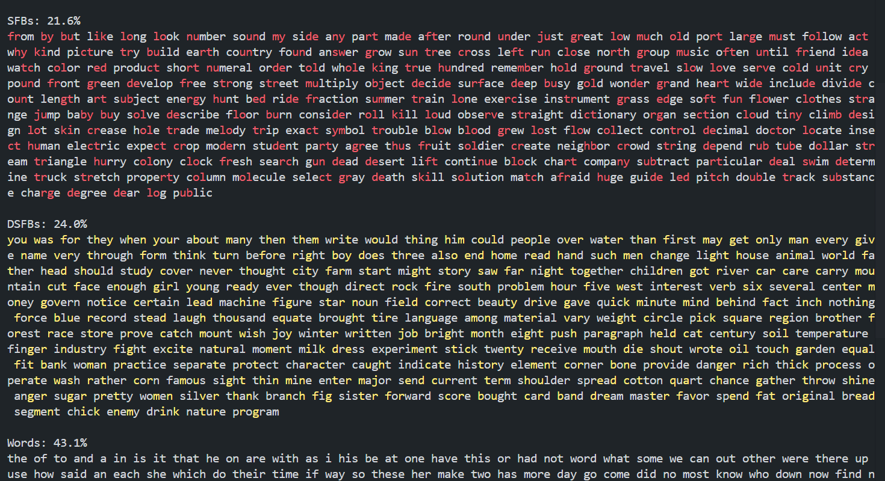

brief summary:
a program that is used to improve your typing speed by detecting something called SFBs and DSFBs in common English words, to practice these specific words.

Getting 210 WPM on https://monkeytype.com ( TOP 500 on the world )
